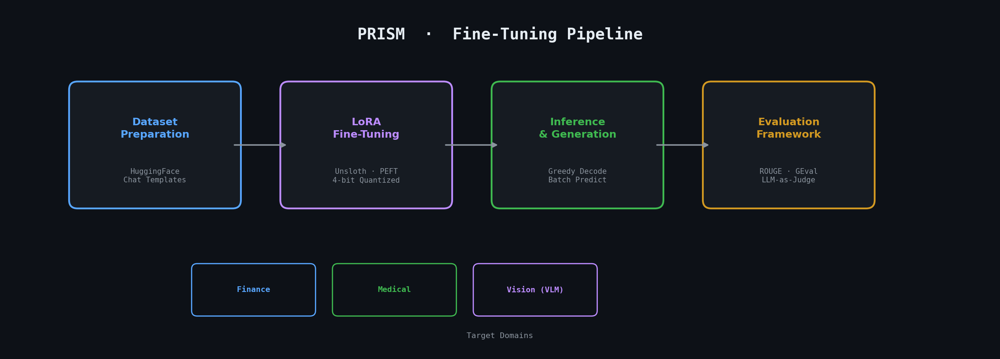
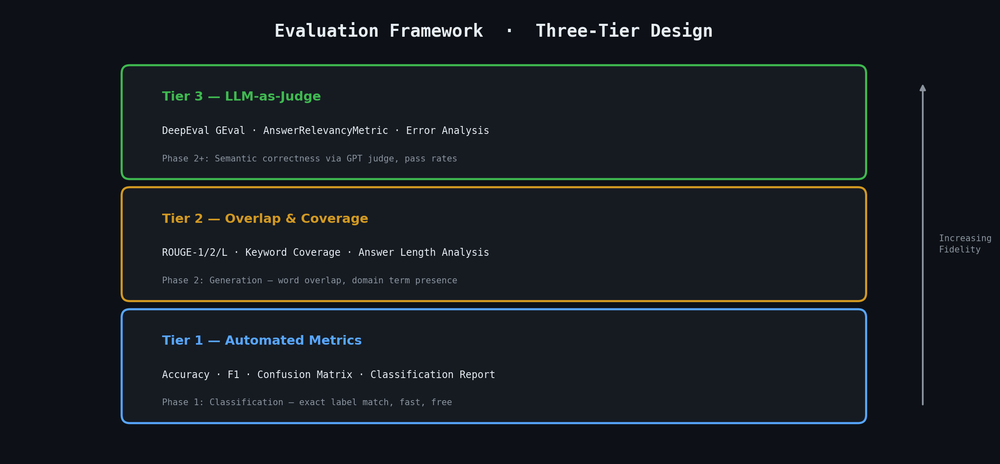

# PRISM

### Parameter-efficient Reasoning for Industry-Specific Multimodal Systems

> **Teaching small models to think like domain experts — one adapter at a time.**

PRISM is a systematic exploration of parameter-efficient fine-tuning across healthcare and finance, progressing from text classification through instruction tuning to multimodal vision-language models. Every experiment follows an evaluation-driven methodology: baseline first, fine-tune second, measure everything third.

---

## Pipeline



Each phase follows the same disciplined loop: prepare domain-specific data, apply LoRA adapters to a quantized base model, generate predictions, then evaluate with progressively sophisticated metrics. The pipeline scales from single-word classification to multi-sentence medical reasoning without changing the core architecture.

---

## Evaluation Framework




**Tier 1 — Automated Metrics**: Accuracy, weighted F1, per-class precision/recall, and confusion matrices for classification tasks. Fast, free, and deterministic.

**Tier 2 — Overlap & Coverage**: ROUGE-1/2/L for word overlap, plus a custom keyword coverage metric that checks whether domain-critical terms (medical terminology, financial indicators) appear in model outputs. Catches content gaps that accuracy alone misses.

**Tier 3 — LLM-as-Judge**: DeepEval's GEval and AnswerRelevancyMetric using GPT as an external judge. Essential for generative tasks where two semantically equivalent answers share zero exact words. Evaluates medical correctness and answer relevance independently.

---

## Completed Work

### Environment Verification ✅

Validates the full toolchain before spending compute: Unsloth model loading, LoRA adapter application, SFTTrainer execution (10 steps on toy data), inference generation, and DeepEval imports.

### Notebook 1 · Financial Sentiment Classification ✅

| | |
|---|---|
| **Task** | Classify financial news as neutral, bullish, or bearish |
| **Dataset** | `TimKoornstra/financial-tweets-sentiment` — 38,100 expert-annotated sentences |
| **Model** | Qwen3-4B-Instruct-2507 (8-bit quantized) |
| **Method** | Generative SFT — model learns to *output* the label as text, no classification head modification |
| **LoRA Config** | r=16, alpha=32, targets: all attention + FFN projections (q/k/v/o/gate/up/down) |
| **Evaluation** | Accuracy, weighted F1, per-class classification report, confusion matrix, DeepEval GEval |

**Key technical decisions:**
- Chose generative classification over classification head replacement — same SFT pipeline scales to every future phase without architectural changes.
- Stratified 80/20 split preserves label distribution across train/test sets.
- Baseline evaluation runs *before* any training to establish the improvement delta.

**Skills demonstrated:** SFT for classification, chat template formatting, baseline-driven evaluation, confusion matrix analysis, LoRA hyperparameter selection.

### Notebook 2 · Medical Instruction Tuning ✅

| | |
|---|---|
| **Task** | Generate accurate medical answers to clinical questions |
| **Dataset** | `medalpaca/medical_meadow_medical_flashcards` — 33k Q&A pairs across anatomy, pathology, pharmacology |
| **Model** | Qwen2.5-1.5B-Instruct (4-bit quantized) |
| **Method** | Chat-format SFT with system prompt conditioning |
| **Training** | 4,000 examples, 3 epochs, cosine LR schedule, 8bit AdamW |
| **Evaluation** | ROUGE-1/2/L, keyword coverage, DeepEval GEval (Medical Correctness), AnswerRelevancyMetric |

**Why this phase matters — the evaluation problem:**
In Phase 1, evaluation is trivial: did the model say "positive" when the label is "positive"? In Phase 2, the model generates multi-sentence medical answers. Two completely different sentences can both be correct. ROUGE catches word overlap but misses semantic equivalence. Keyword coverage checks for domain terms but can't assess reasoning. Only LLM-as-Judge can evaluate whether "persistent cough with phlegm" and "productive cough" convey the same clinical meaning.

**Key technical decisions:**
- Subset to 4,000 training examples — enough to learn medical patterns, conservative on compute.
- max_seq_length increased from 512 → 1024 to accommodate multi-sentence answers.
- Error analysis examines worst predictions (lowest ROUGE-L) to identify failure patterns: is the model too verbose, hallucinating terms, or confusing related conditions?

**Skills demonstrated:** Instruction tuning, generative evaluation (ROUGE + LLM-as-Judge), answer relevancy assessment, keyword coverage metrics, systematic error analysis.

---

## Technical Approach

**Parameter efficiency:** Every fine-tuning run uses LoRA adapters on 4-bit quantized models. A 1.5B parameter model loads in ~1.5GB VRAM. LoRA adds <1% trainable parameters while achieving meaningful task adaptation.

**No wrappers:** Every notebook calls library APIs directly — `FastLanguageModel.from_pretrained()`, `SFTTrainer()`, `GEval()`. The goal is to understand what these tools actually do, not hide them behind abstractions.

**Reproducibility:** Fixed seeds (42), deterministic splits, saved LoRA adapters. Every experiment can be re-run and compared.

---

## Roadmap

| Phase | Notebook | Focus | Status |
|:-----:|----------|-------|:------:|
| 0 | `Dry-Test_Fine-Tuning-Setup.ipynb` | Env Setup Compatibility | ✅ |
| 1 | `Qwen3_4B_Instruct_Financial_sentiment_fine-tuned.ipynb` | Classification + SFT fundamentals | ✅ |
| 2 | `02_medical_chat.ipynb` | Instruction tuning + generative evaluation | ✅ |
| 3 | `03_finance_qa.ipynb` | Extractive QA, context grounding, faithfulness | 🔜 |
| 4 | `04_vlm_deep_dive.ipynb` | VLM architecture study (vision encoder → LLM) | 🔜 |
| 5 | `05_medical_vqa.ipynb` | Fine-tune VLM on radiology images | 🔜 |
| 6 | `06_finance_vqa.ipynb` | Fine-tune VLM on charts & documents | 🔜 |
| 7 | `07_portfolio.ipynb` | End-to-end demo, final benchmarks | 🔜 |

---

## Tech Stack

| Layer | Tools |
|-------|-------|
| Fine-tuning engine | Unsloth (4x speedup, memory-efficient) |
| Adapter framework | PEFT (LoRA, quantized training) |
| Training loop | TRL SFTTrainer |
| Evaluation | DeepEval (GEval, AnswerRelevancy), scikit-learn, ROUGE |
| Models | Qwen2.5-1.5B-Instruct (text), Qwen2-VL (vision — upcoming) |
| Data | HuggingFace Datasets |
| Compute | Google Colab (H100/A100) |

---

## Project Structure

```
prism/
├── README.md
├── assets/
│   ├── pipeline.png         # Fine-tuning pipeline diagram
│   └── evaluation_tiers.png # Evaluation framework diagram
├── notebooks/
│   ├── environment_check.ipynb    # toolchain verification
│   ├── Qwen3_4B_Instruct_Financial_sentiment_fine-tuned.      ipynb                      # Phase 1 — classification
│   └── 02_medical_chat.ipynb        # Phase 2 — instruction tuning
└── outputs/                         # Training artifacts & adapters
```


---

## Core Concepts

**LoRA (Low-Rank Adaptation):** Instead of updating all model weights W, learn a low-rank decomposition W' = W + BA where B and A are small matrices. For a 4096×4096 weight matrix with rank r=16, this reduces trainable parameters from 16M to 130K — a 99% reduction while preserving model quality.

**Generative Classification:** Rather than adding a classification head, teach the model to generate the label as text. The same SFT pipeline works for classification ("positive"), short answers ("Legionella pneumophila"), and multi-paragraph explanations — no architecture changes needed.

**LLM-as-Judge:** Use a strong external model (GPT-4o-mini via DeepEval) to evaluate whether generated answers are semantically correct, even when they use different vocabulary than the reference. Critical for any generative task where exact match fails.
